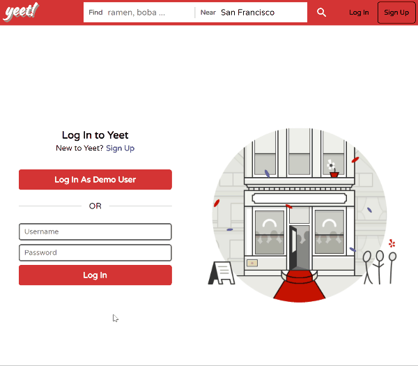

# README

Technologies:  


# YEET

Yeet is a full-stack web application similar to Yelp.com. Yeet allows user to search for ramen and boba milk tea places in Bay Area.

[Live Link](https://yeet-fullstack.herokuapp.com/#/)

<!--  -->


# Documentaion

+ [MVP List](https://github.com/tokyoanime/yeet/wiki/mvp-list)
+ [Schema](https://github.com/tokyoanime/yeet/wiki/schema)
+ [Sample State](https://github.com/tokyoanime/yeet/wiki/sample-state)
+ [Frontend Routes and Components](https://github.com/tokyoanime/yeet/wiki/frontend-routes)
+ [Backend Routes](https://github.com/tokyoanime/yeet/wiki/backend-routes)

---

```
def self.text_search(query)
  keyword = query["keyword"]
  near = query["near"]
  filter = query["filter"]
  
  if near.empty?
    near = "San Francisco"
  end

  if keyword.empty?
    return where('biz_city @@ :n', n: near)
  else
    return where('biz_name @@ :k or biz_first_cat @@ :k or biz_second_cat @@ :k or biz_third_cat @@ :k', k: keyword).where('biz_city @@ :n', n: near);
  end
end
```
Above code snippet performs a simple full text search in PostgreSQL using match operator @@.

---


```
handleDemoLogin() {
  let demoUsername = "demoUser".split('');
  let demoPassword = "password".split('');
  let userTimer = 0;
  let passTimer = 0;
  this.setState({ username: '', password: '' });
  document.getElementById('btn-demo-login').setAttribute('disabled','true');
  document.getElementById('btn-session-login').setAttribute('disabled','true');

  const typeUsername = (i) => {
    let uName = this.state.username + i;
    this.setState({username: uName})
  }

  const typePassword = (j) => {
    let uPass = this.state.password + j;
    this.setState({password: uPass})
  }

  for (let i = 0; i < demoUsername.length; i++) {
    userTimer += 50;
    setTimeout(() => typeUsername(demoUsername[i]), userTimer);
  }

  for (let j = 0; j < demoPassword.length; j++) {
    passTimer += 50;
    setTimeout(() => typePassword(demoPassword[j]), passTimer);
  }

  const loginUser = () => {
    if (this.state.username === "demoUser" && this.state.password === "password") {
      clearInterval(login);
      this.props.login(this.state)
        .then(() => this.props.history.goBack());
    }
  }

  const login = setInterval(loginUser, 500);
}
```
Demo user login used JavaScript setTimeout, setInterval and clearInterval to automatically fill out username and password field and log in the user after.

